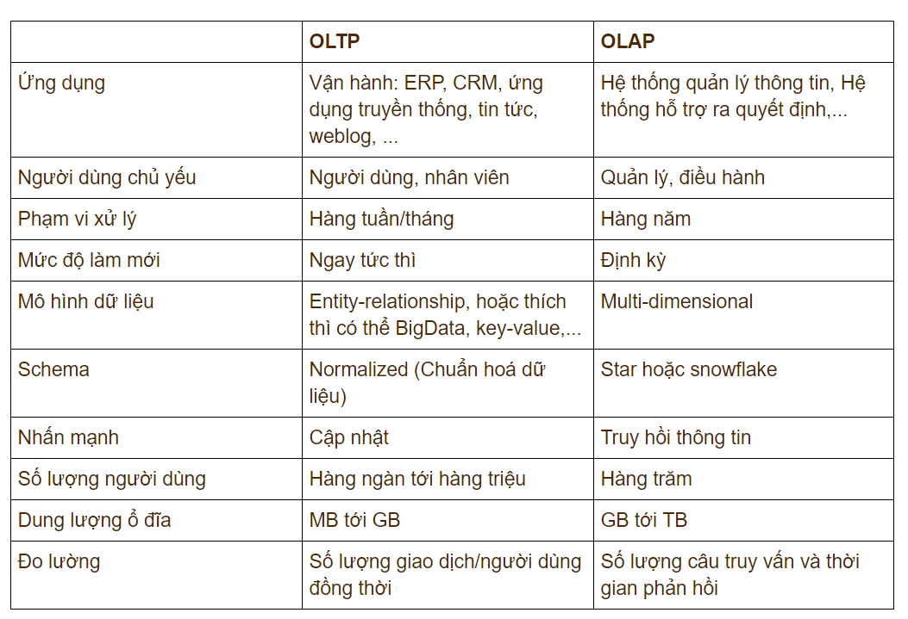

<h1 align="center">ClickHouse</h1>

ClickHouse là một hệ quản trị cơ sở dữ liệu OLAP (Online Analytical Processing) dạng cột, được thiết kế để xử lý tối ưu hàng tỷ bản ghi, truy vấn cực nhanh, phân tích dữ liệu trong thời gian thực và nén dữ liệu tốt. 

Khác với các cơ sở dữ liệu OLTP, ClickHouse được tối ưu cho ứng dụng đọc và phân tích dữ liệu. Với việc sử dụng mô hình lưu trữ cột, ClickHouse có khả năng tối ưu hóa hiệu suất cho các truy vấn chỉ yêu cầu một số lượng nhỏ cột, tiết kiệm băng thông và thời gian xử lý.

**OLTP và OLAP**



OLTP (Online Transactional Processing) là hệ thống cơ sở dữ liệu xử lý các giao dịch phát sinh liên tục. VD: website bán hàng, internet banking, POS, đăng nhập người dùng... Mỗi thao tác thường tác động tới ít bản ghi.

Đặc điểm:

- Nhiều người dùng truy cập cùng lúc.

- Dữ liệu luôn được cập nhật.

- Yêu cầu tính ACID (Atomicity: tính nguyên tử, Consistency: tính nhất quán, Isolation: tính cô lập, Durability: tính bền vững)

- Tập trung vào transaction. Khi một hệ thống OLTP hoạt động, mọi bước phải thành công hoặc có thể rollback.

OLAP (Online Analytical Processing) là hệ thống CSDL được thiết kế để làm việc với lượng dữ liệu rất lớn, phục vụ việc phân tích dữ liệu. VD: thống kê doanh thu, top sản phẩm bán chạy hay nhật ký hoạt động của server, ứng dụng.

Đặc điểm:

- Được tối ưu cho việc đọc dữ liệu rất lớn, nén dữ liệu, tính toán song song, truy vấn tổng hợp và scan hàng tỉ bản ghi.

- Không để tâm tới đảm bảo tính chính xác và toàn vẹn của giao dịch dữ liệu hay cập nhật dữ liệu cũ.

Một ví dụ thực tế: Trong một nền tảng mua hàng trực tuyến, những hoạt động liên quan tới mua bán như tạo đơn hàng, cập nhật kho hàng, thực hiện giao dịch... sẽ sử dụng OLTP. Những hoạt động thống kê như doanh thu, xu hướng mua hàng, lịch sử mua hàng... sẽ sử dụng OLAP.

ClickHouse là một trong những CSDL OLAP phổ biến nhất, được sử dụng rộng rãi cho những nhu cầu lưu trữ log, big data...

**Đặc điểm**

Mấu chốt để hiểu được ClickHouse chính là tìm hiểu về engine quản lý bảng của nó là MergeTree engine.

**MergeTree engine**

MergeTree engine là thành phần quan trọng nhất trong ClickHouse, là engine vận hành bảng. Những đặc điểm chính của MergeTree table engine:

- Dữ liệu được lưu theo part. MergeTree ko ghi trực tiếp vào 1 file dữ liệu duy nhất. Mỗi lần insert, engine tạo ra 1 data part mới. VD:

```
INSERT 100,000 rows -> Part A
INSERT 50,000 rows -> Part B
INSERT 80,000 rows -> Part C
```

Sau đó, engine gộp các part nhỏ thành part lớn hơn. Giúp ghi dữ liệu nhanh, nhiều tiến trình có thể ghi đồng thời.

- Background merge: MergeTree liên tục chạy các tiến trình nền để hợp nhất các part, giúp giảm số lượng file, giảm lượng index cần đọc, tăng tốc độ truy vấn.

- Lưu trữ theo cột: engine lưu từng cột của bảng thành file riêng biệt. VD: bảng có 4 cột Timestamp, Service, Status, Duration thì sẽ được lưu thành 4 file Timestamp.bin, Service.bin, Status.bin, Duration.bin. Nếu truy vấn SELECT avg(Duration) FROM logs; thì ClickHouse chỉ cần đọc Duration.bin thay vì toàn bộ dữ liệu như lưu trữ dạng hàng.

- MergeTree ko tạo index cho từng dòng, primary index chỉ lưu giá trị đầu tiên của mỗi granule, một granule là mặc định 8192 dòng => index rất nhỏ, tiết kiệm RAM, tìm dữ liệu nhanh nhưng ko chính xác bằng các CSDL OLTP.

- ORDER BY quyết định cách sắp xếp dữ liệu. VD:

```
ORDER BY
(
    timestamp,
    service_name
)
```

thì mỗi part sẽ được sắp xếp kiểu như sau:

```
2026-07-01 frontend
2026-07-01 frontend
2026-07-01 backend
2026-07-02 frontend
```

để khi cần query 1 timestamp hay service_name cụ thể, query sẽ được xử lý rất nhanh.

- MergeTree hỗ trợ chia dữ liệu thành nhiều partition. VD: PARTITION BY toYYYYMM(timestamp). Khi truy vấn WHERE timestamp >= '2026-07-01' thì ClickHouse sẽ bỏ qua toàn bộ partition của tháng 6 và 8.

- Hỗ trợ TTL (Time to live), background process sẽ tự động xóa dữ liệu hết TTL. Thời gian này có thể thay đổi được.

- Update và delete bất đồng bộ. Khi thực hiện sửa hay xóa dữ liệu, engine sẽ tạo mutation, đợi background process merge, sinh part mới và xóa part cũ. Cách làm này ko khóa bảng và ko ảnh hưởng đến việc ghi dữ liệu nhưng dữ liệu bị xóa sẽ ko biến mất ngay lập tức.

**Vì sao ClickHouse rất nhanh**

Do kết hợp các cơ chế như:

- Chỉ đọc các cột cần thiết.

- Compression, ít dữ liệu phải đọc từ disk.

- Vectorized execution: xử lý rất nhiều dữ liệu mỗi lần thay vì từng dòng.

- Index nhỏ, tìm vùng dữ liệu nhanh.

- Đọc nhiều part và cột song song.

- Background merge, giảm số lượng part, tối ưu việc đọc.

- Bỏ qua các partition không liên quan.

VD có truy vấn như sau:

```
SELECT avg(duration)
FROM logs
WHERE Timestamp >= '2026-07-01'
  AND Timestamp < '2026-07-02'
  AND Service = 'frontend';
```

Các bước nội bộ:

1. Partition pruning: chỉ đọc partition có ngày tháng chứa "2026-07-01"

2. Primary index: dùng "Timestamp" để xác định các granule cần đọc.

3. Skip index: bỏ qua các granule ko chứa "frontend"

4. Column pruning: chỉ mở các cột Timestamp, Service và duration.

5. Vectorized excecution: tính avg(duration) trên từng khối dữ liệu lớn thay vì từng bản ghi.

6. Parallel processing: nếu có nhiều part, nhiều luồng sẽ đọc và xử lý đồng thời rồi gộp kết quả.

**Khi nào nên sử dụng ClickHouse**

- Phân tích dữ liệu lớn (OLAP): ClickHouse được tối ưu cho việc xử lý các truy vấn phân tích phức tạp trên tập dữ liệu khổng lồ.

- Phân tích nhật ký hoạt động của server và ứng dụng: ClickHouse xử lý hiệu quả các tập tin nhật ký lớn, dễ dàng trích xuất thông tin, phát hiện sự cố, tối ưu hiệu năng và cải thiện trải nghiệm người dùng.

- Phân tích dữ liệu thời gian thực: Khả năng xử lý luồng dữ liệu thời gian thực của ClickHouse giúp bạn nắm bắt nhanh chóng các xu hướng và hành vi người dùng, hỗ trợ ra quyết định nhanh chóng.

- Tạo báo cáo và bảng điều khiển: ClickHouse tạo ra các báo cáo trực quan và bảng điều khiển thông tin hiệu quả, giúp theo dõi hiệu suất kinh doanh, hoạt động marketing và các chỉ số quan trọng khác.

**Khi nào không nên sử dụng ClickHouse**

- ClickHouse không được thiết kế để xử lý các truy vấn cập nhật dữ liệu thường xuyên (OLTP), Nếu cần thực hiện các giao dịch trực tuyến thường xuyên thì ClickHouse không phải là lựa chọn tốt.

- Hạn chế trong việc xử lý các transaction phức tạp: ClickHouse đơn giản hóa việc quản lý transaction, do đó không phù hợp với các ứng dụng cần xử lý các transaction phức tạp.

- Không hiệu quả khi cần thực hiện truy xuất dữ liệu theo từng hàng: ClickHouse không thể thực hiện tác vụ truy xuất và tìm kiếm nhanh các hàng riêng lẻ theo khóa.

**Kết luận**

ClickHouse lý tưởng cho các ứng dụng phân tích dữ liệu quy mô lớn. Với tốc độ xử lý truy vấn nhanh, hỗ trợ các truy vấn phức tạp và khả năng mở rộng, ClickHouse đang ngày càng được ưa chuộng trong nhiều lĩnh vực.